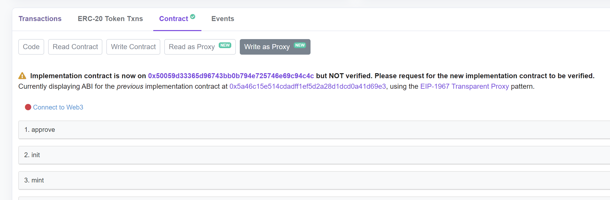

# Assignment week10

### 1. Make the three contracts for the NFT, ERC20 token, and staking contract upgradeable using Openzeppelin upgradability plugin. Deploy it from hardhat.

#### ERC20

[Contract v1](./contracts/UpgradeableERC20.sol)

[Implementation v1](https://mumbai.polygonscan.com/address/0xe8c8ca5fafbe877eb7ea6e267e952d09732c05e5#code)

[Proxy ERC20 v1](https://mumbai.polygonscan.com/address/0xe631dd6e70653df04dca12ba03cef7baed2e45b0#code)

#### NFT

[Contract](./contracts/UpgradeableNFT.sol)

[Implementation v1](https://mumbai.polygonscan.com/address/0x5a46c15e514cdadff1ef5d2a28d1dcd0a41d69e3#code)

[Proxy ERC721 v1](https://mumbai.polygonscan.com/address/0x93fe8d93957a27571b2c58f7f4521a74b43b971c#code)

#### Staking

[Contract](./contracts/UpgradeableStaking.sol)

[Implementation v1](https://mumbai.polygonscan.com/address/0x8cffa76ac8bb3c0c860fea8cf81248c91787ee27#code)

[Proxy Staking v1](https://mumbai.polygonscan.com/address/0xc7d02dab37ac1b81118875f663e0d7e0120269f5#code)

### 2. Build a new version of the NFT that adds god mode to the NFT (the ability to transfer NFTs between accounts forcefully). Etherscan should show the previous version and the new version

Just after updating to NFTv2, Etherscan ask me to verify the new implementation to show the ABI properly

[Contract](./contracts/UpgradeableNFTGodMode.sol)

[Implementation v2](https://mumbai.polygonscan.com/address/0x50059d33365d96743bb0b794e725746e69c94c4c#code)

[Proxy NFT(same as before)](https://mumbai.polygonscan.com/address/0x93fe8d93957a27571b2c58f7f4521a74b43b971c#code)

