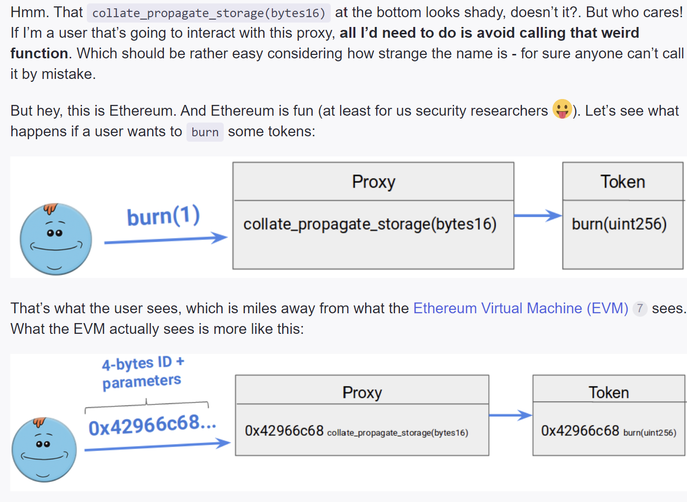

# UNSAFE CODE FOR UPGRADEABLE CONTRACTS

MUST NOT HAVE:
-constructor
-initialize called more than once
-reorder storage (should have same layout for the storage of the v1 contract)
-selfdestruct/kill function

## UUPS vs Transparent deployment

    1.
    const Token = await hre.ethers.getContractFactory("MyTokenUpgradable");
    deploy Transparent proxy
    const tokenProxy = await hre.upgrades.deployProxy(Token, ["PROXY","PRX"],{ initializer:"initialize"})

    2.
    const Token = await hre.ethers.getContractFactory("MyTokenUpgradable");
    deploy Universal upgradeable proxy standar UUPS
    const tokenProxy = await hre.upgrades.deployProxy(Token, ["PROXY","PRX"],{kind: "uups", initializer:"initialize"})

## UUPS

    -We need to add the upgradedTo() to the UUPS contract, so we need to inherit from UUPSUpgradeable
    -We need to add the function
    `function _authorizeUpgrade(address newImplementation) internal override {}`
    to the proxy, and write the implementation of the function, (recommended just use "onlyOwner")

## Function clashing

    [Beware of the proxy: learn how to exploit function clashing](https://forum.openzeppelin.com/t/beware-of-the-proxy-learn-how-to-exploit-function-clashing/1070)
    
