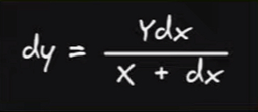
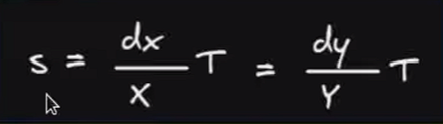
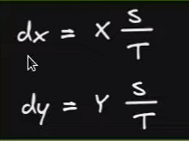

# Constant Product AMM Formulas

[Youtube source](https://www.youtube.com/watch?v=QNPyFs8Wybk)

    A = Total token A
    B = Total token B
    da = tokenA coming in/out
    db = tokenB coming in/out
    TS = total shares

# 1. SWAP FORMULA CPAMM

    da = A*db
        ______
        B + db

    db = B*da
        ______
        A + da

# 2. ADD LIQUIDITY FORMULA CPAMM

    Formula how many tokens to add:
        (the left side should be equal to the division of A/B)
     da      A
    ____  = ____
     db      B

    SHORT:
        TS = total shares

                         da       TS      db      TS
        sharesToMint = ______ * _____ =  _____ * ____
                          A       1        B       1

    LONG:
        TotalLiquidityBefore = sqrt(A*B)
        TotalLiquidityAfter = sqrt( (A+da) * (B+db) )

                        LiquidityAfter - LiquidityBefore   Total shares
        sharesToMint = ________________________________ * ______________
                                LiquidityBefore                  1

# 3. REMOVE LIQUIDITY FORMULA CPAMM

    da = reserveTokenA * (SharesToBurn / TotalShares)
    db = reserveTokenB * (SharesToBurn / TotalShares)

### 1. Explanation Swap

    X * Y = K
    X = token A
    Y = token B
    K = constant product

    Example 1:
        Sell token A(in), buy B(out)
        Price before trade: A * B = K
        Price after trade: (A + da) * (B - db) = K'

    Example 2:
        -Reserve A = 500
        -Reserve B = 2000
        -Buy 100 token B
        User swaping 100 token B for "da" token A
        db = +100tokenB (in)
        da = -da (out)

        LONG FORMULA:
            (TokenA - da) * (TokenB + db) = 1_000_000
            (500 - da) * (2_000 + db) = 1_000_000
            (500 - da) * (2_000 + 100) = 1_000_000
            (500 - da) * (2_100) = 1_000_000
            (500 - da) = 1_000_000 / 2_100
            (500 - da) = 476,19
            - da = -500 + 476,19
            da = 500 - 476,19
            da = 23,80

        SHORT FORMULA:
            da = A * db / B + db
            da = 500 * 100 / 2_000 + 100
            da = 23.80

        CONSTANT:
            (500 - 23,80) * (2_000 + 100) = 1_000_000
            476,2 * 2_100 = 1_000_000

        SOLUTION
            The user will receive 23,80 token A in exchange of selling 100 token B

### 2. Explanation Add liquidity (constraints)

    before trade -->  A * B = K
    after trade --> ( A + da ) * ( B + db ) = K

    -No price changes before and after adding liquidity

    Example 1:
    A = 500
    B = 1500

    Formula:
     da      A
    ____  = ____
     db      B

    -Add 1000 tokenB
        A/B = 0.33

        da/1000 = 0.33
        da = 0.33*1000
        da = 333.33

        330      500
        ______ = ____ = 0.3333
        1000     1500

    -Add 1000 tokenA

        A/B = 0.3333

        1000/db = 0.33
        db = 1000/0.33
        db = 3000

        1000     500
        ______ = ____ = 0.3333
        3000     1500

    -Shares to mint for the first time (when total shares = 0)

        SharesToMint = sqrt(A * B)
        SharesToMint = sqrt(500*1500)
        SharesToMint = 866

    -Shares to mint (when totalShares > 0)
        -adding 1000 Token A and 3000 Token B

        1.
            SharesToMint = sqrt((da) * (db))
            SharesToMint = sqrt((1000) * (3000))
            SharesToMint = 1732

        OR

        2.              1000           3000
        SharesToMint = ______ * 866 = ______ * 866
                         500           1500

        SharesToMint = ( 866_000 / 500 ) =( 2_598_000 / 1500 )

        SharesToMint = 1732 = 1732

### 2. Explanation Remove liquidity

    Example 1:
        A = 4500
        B = 1500
        TS = 2598

        Let's butn 1598 shares
        da = reserveTokenA * (SharesToBurn / TotalShares)
        da = 4500 * (1598/2598)
        da = 2767
        A = 4500 - 2767

        db = reserveTokenB * (SharesToBurn / TotalShares)
        db = 1500 * (1598/2598)
        db = 922
        B = 1500 - 922

        new reserves:
        A = 1733
        B = 578
