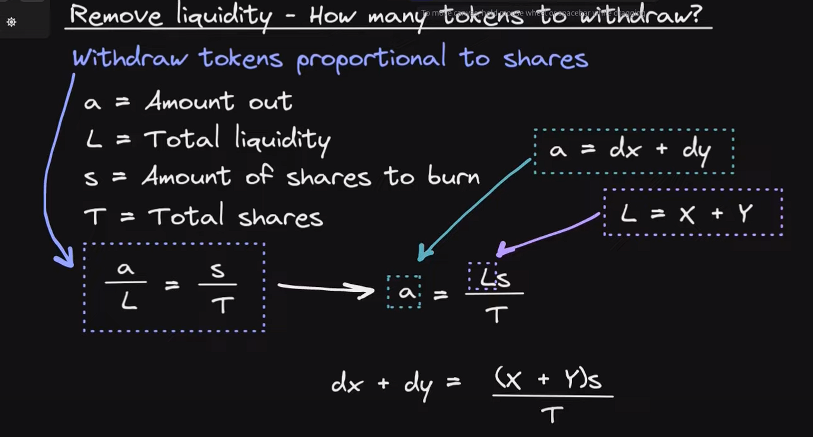

# Constant Sum AMM Math

[Youtube source](https://www.youtube.com/watch?v=-JhgcqvyYeM)

### 1. What can we do with an AMM?

    **Add liquidity**: user send token A and token B to the liquidity pool
    in return it gets some shares that represent the % of shares provided to the LP

    **Swap**: user send token A(add to the LP) to get token B(subtract from the LP)

    **Remove Liquidity**: user can withdraw his tokens from the LP, depending on his shares, that % will be sent to him (quantity of token A and B may vary)

### 2. What is a constant sum AMM?

    X + Y = K

    X= amount of token A in the AMM

    Y= amount of token B in the AMM

    K= product of X\*Y

# Constant Sum AMM Formulas

# SWAP FORMULA CSAMM

# ADD LIQUIDITY FORMULA CSAMM

    X = amount token A in the LP
    Y = amount token B in the LP
    dx = amount token A coming into the LP
    dy = amount token B coming into the LP

    FINAL FORMULA:

    shares to mint =  ((amount token A coming in)+(amount token B coming in))*total shares
                      _____________________________________________________________________
                                (token A in the LP + token B in the LP)

# REMOVE LIQUIDITY FORMULA CSAMM

    FINAL FORMULA:
    token out A(dx) = (amount token A in the LP)*(shares to burn)
                   __________________________________________
                                    total shares

    token out B(dy) = (amount token B in the LP)*(shares to burn)
                   __________________________________________
                                    total shares

