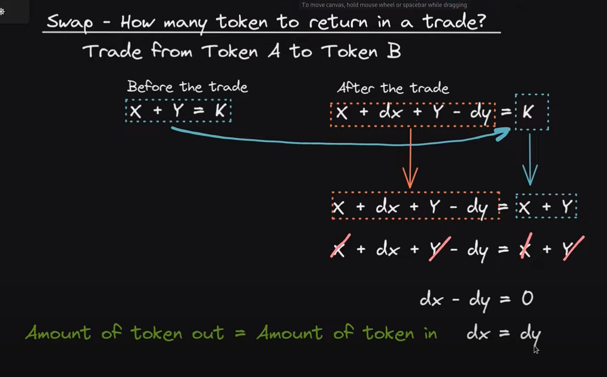

## Automated market maker

## Order Books vs AMM

[Youtube source](https://www.youtube.com/watch?v=Ui1TBPdnEJU)

### 1. Order books

    -Order book is what the exchanges uses

    -Alice wants to sell 1 BTC for 20k

    -Bob wants to buy 1 BTC for 19k

    -the exchange will wait until the users get into a middle price and execute the order from user A to user B

### 2. AMM

    -Blockchain is too expensive and slow to wait to execute this transactions

    -We use liquidity pools with a constant to determine the price of the asset

    -example of a liquidity pool of 10eth and 1000usdt

    -FORMULA (X \* Y) = K(constant)

        Case study:
        10(eth) * 1_000(usdt) = 10_000(constant)
        current price 1eth: 1000usdt/10eth = 100usdt
        current price 1usdt: 10eth/1000usdt = 0.001eth

        -someone wants to buy 1 eth then the LP change as follows:
        (10-1) * (1_000 + x) = 10_000
        (9) * (1_000 + x )= 10_000
        (1_000 + x) = 10_000/9
        (1_000 + x) = 1_111
        x = 1_111 - 1_000
        x = 111
        final formula knowing "x" keeping the constant:
        (10-1) * (1_000 + 111) = 10_000
        9 * 1_111 = 10_000
        10_000 = 10_000

## Constant Sum AMM Math

[Youtube source](https://www.youtube.com/watch?v=-JhgcqvyYeM)

### 1. What can we do with an AMM?

    **Add liquidity**: user send token A and token B to the liquidity pool
    in return it gets some shares that represent the % of shares provided to the LP

    **Swap**: user send token A(add to the LP) to get token B(subtract from the LP)

    **Remove Liquidity**: user can withdraw his tokens from the LP, depending on his shares, that % will be sent to him (quantity of token A and B may vary)

### 2. What is a constant sum AMM?

    X + Y = K

    X= amount of token A in the AMM

    Y= amount of token B in the AMM

    K= product of X\*Y

**SWAP**

**ADD LIQUIDITY**
