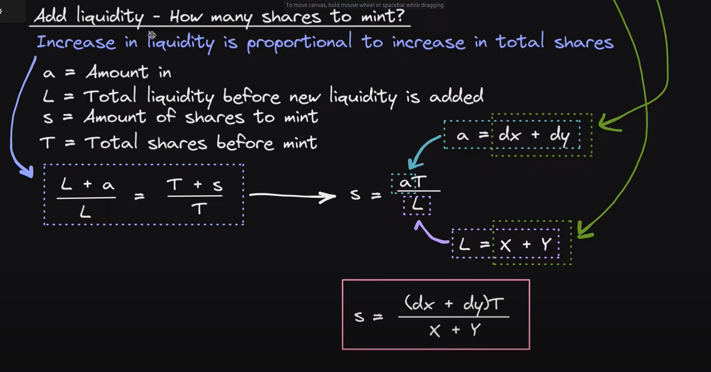
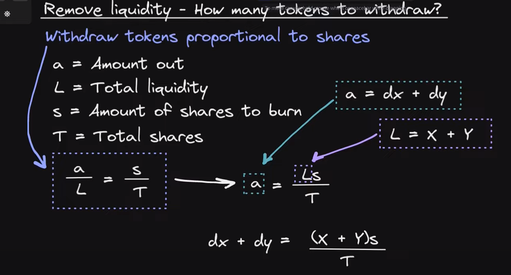
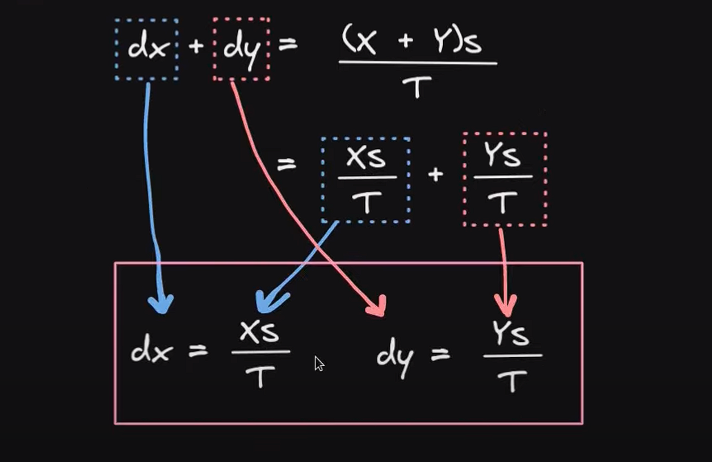

## Automated market maker

# Order Books vs AMM

[Youtube source](https://www.youtube.com/watch?v=Ui1TBPdnEJU)

### 1. Order books

    -Order book is what the exchanges uses

    -Alice wants to sell 1 BTC for 20k

    -Bob wants to buy 1 BTC for 19k

    -the exchange will wait until the users get into a middle price and execute the order from user A to user B

### 2. AMM

    -Blockchain is too expensive and slow to wait to execute this transactions

    -We use liquidity pools with a constant to determine the price of the asset

    -example of a liquidity pool of 10eth and 1000usdt

    -FORMULA (X * Y) = K(constant)

        Case study:
        10(eth) * 1_000(usdt) = 10_000(constant)
        current price 1eth: 1000usdt/10eth = 100usdt
        current price 1usdt: 10eth/1000usdt = 0.001eth

        -someone wants to buy 1 eth then the LP change as follows:
        (10-1) * (1_000 + x) = 10_000
        (9) * (1_000 + x )= 10_000
        (1_000 + x) = 10_000/9
        (1_000 + x) = 1_111
        x = 1_111 - 1_000
        x = 111
        final formula knowing "x" keeping the constant:
        (10-1) * (1_000 + 111) = 10_000
        9 * 1_111 = 10_000
        10_000 = 10_000

# Constant Sum AMM Math

[Youtube source](https://www.youtube.com/watch?v=-JhgcqvyYeM)

### 1. What can we do with an AMM?

    **Add liquidity**: user send token A and token B to the liquidity pool
    in return it gets some shares that represent the % of shares provided to the LP

    **Swap**: user send token A(add to the LP) to get token B(subtract from the LP)

    **Remove Liquidity**: user can withdraw his tokens from the LP, depending on his shares, that % will be sent to him (quantity of token A and B may vary)

### 2. What is a constant sum AMM?

    X + Y = K

    X= amount of token A in the AMM

    Y= amount of token B in the AMM

    K= product of X\*Y

# CSAMM Formulas

**SWAP**

**ADD LIQUIDITY**

    X = amount token A in the LP
    Y = amount token B in the LP
    dx = amount token A coming into the LP
    dy = amount token B coming into the LP

    FINAL FORMULA:

    shares to mint =  ((amount token A coming in)+(amount token B coming in))*total shares
                      _____________________________________________________________________
                                (token A in the LP + token B in the LP)

**REMOVE LIQUIDITY**

    FINAL FORMULA:
    token out A(dx) = (amount token A in the LP)*(shares to burn)
                   __________________________________________
                                    total shares

    token out B(dy) = (amount token B in the LP)*(shares to burn)
                   __________________________________________
                                    total shares

# Constant Product AMM Math

[Youtube source](https://www.youtube.com/watch?v=QNPyFs8Wybk)

### 1. Price is determined by the equation

    X * Y = K
    X = token A
    Y = token B
    K = constant product

    Example 1:
        Sell token A(in), buy B(out)
        Price before trade: A * B = K
        Price after trade: (A + da) * (B - db) = K

    Example 2:
        -Reserve A = 500
        -Reserve B = 2000
        -Buy 100 token B
        User swaping 100 token B for "da" token A
        db = +100tokenB (in)
        da = -da (out)

        LONG FORMULA:
            (TokenA - da) * (TokenB + db) = 1_000_000
            (500 - da) * (2_000 + db) = 1_000_000
            (500 - da) * (2_000 + 100) = 1_000_000
            (500 - da) * (2_100) = 1_000_000
            (500 - da) = 1_000_000 / 2_100
            (500 - da) = 476,19
            - da = -500 + 476,19
            da = 500 - 476,19
            da = 23,80

        SHORT FORMULA:
            da = A * db / B + db
            da = 500 * 100 / 2_000 + 100
            da = 23.80

        CONSTANT:
            (500 - 23,80) * (2_000 + 100) = 1_000_000
            476,2 * 2_100 = 1_000_000

        SOLUTION
            The user will receive 23,80 token A in exchange of selling 100 token B

### 2 Formulas in total:

    SWAP A for B
        1. user selling token A
            +da
            -db
        (A + da) * (B - db)= K

        2. user buying token B
            +da
            -db
        (A + da) * (B - db)= K

        FINAL FORMULA:

        da = A*db
            ______
            B + db

    OR

    SWAP B for A
        3. user selling token B
            +db
            -da
        (A - da) * (B + db)= K

        4. user buying token A
            +db
            -da
        (A - da) * (B + db)= K
