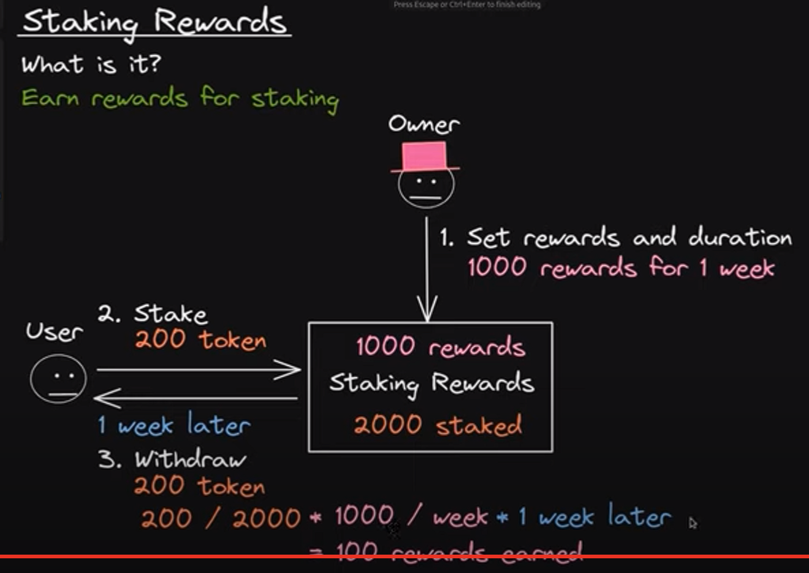

# Staking

[Youtube source](https://www.youtube.com/watch?v=rXuDelwHLoo)

    Example:

        Rewards = 5000 tokens A x week
        Total staked = 1000 token B

        User 1 = staked 200 tokens B
        User 2 = staked 500 tokens B
        User 3 = staked 300 tokens B

        Rewards distribution x week:
        distribution = stakedPerUser / totalStaked * rewards
        User 1 = 200 B / 1000 B * 5000 A
        User 2 = 500 B / 1000 B * 5000 A
        User 3 = 300 B / 1000 B * 5000 A

        User 1 = 1000 tokens A
        User 2 = 2500 tokens A
        User 3 = 1500 tokens A

