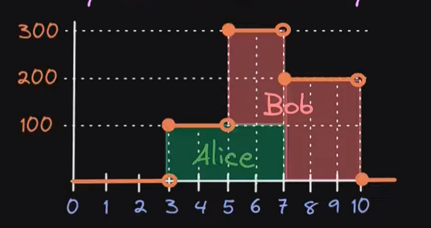
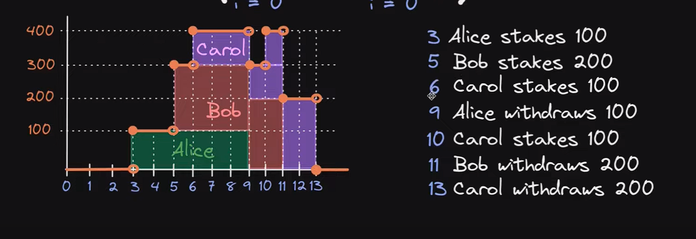

# Staking video 1

[Youtube source](https://www.youtube.com/watch?v=rXuDelwHLoo)

    Example:

        Rewards = 5000 tokens A x week
        Total staked = 1000 token B

        User 1 = staked 200 tokens B
        User 2 = staked 500 tokens B
        User 3 = staked 300 tokens B

        Rewards distribution x week:
        distribution = stakedPerUser / totalStaked * rewards
        User 1 = 200 B / 1000 B * 5000 A
        User 2 = 500 B / 1000 B * 5000 A
        User 3 = 300 B / 1000 B * 5000 A

        User 1 = 1000 tokens A
        User 2 = 2500 tokens A
        User 3 = 1500 tokens A

# Staking Math examples 1

[Youtube Source](https://www.youtube.com/watch?v=oJOsdDJRNVw)

    FORMULA PER SECOND, rewards generated per user
    StakedByUser
    _____________ * RewardPerSecond
    TotalStaked

## Example 1

    AliceStake = 100 token
    AliceTimeStaked = 3 seconds
    totalStaked = 100 token

    Formula
    stakedByAlice = 100 tokenA
    totalSupply = 100 tokenA
    rewardPerSecond = 5

                                  stakedByAlice
    every second we run this --> ________________ * rewardPerSecond --> 100/100 * 5
                                totalSupplyStaked

    Assumptions:
    Alice staked fully 100 tokens for 3 seconds
    No one else staked more tokens in those 3 seconds period

      second 1        second 2        second 3
    (100/100 * R) + (100/100 * R) + (100/100 * R) = 3R = 3*5 = 15 rewards

## Example 2

    Rewards per second = 5
    Alice stakes 100 tokens for 4 seconds
    Bob stakes 200 tokens for 5 seconds

    Alice withdraws 100 tokens
    Bob withdraws 200 tokens

    Alice
    s3 = 100/100 * 5 = 5
    s4 = 100/100 * 5 = 5
    s5 = 100/300 * 5 = 1.66
    s6 = 100/300 * 5 = 1.66
    total rewards Alice = 13.32

    Bob
    s5 = 200/300 * 5 = 3.33
    s6 = 200/300 * 5 = 3.33
    s7 = 200/200 * 5 = 5
    s8 = 200/200 * 5 = 5
    s9 = 200/200 * 5 = 5
    total rewards Bob = 21.66

# Math examples 1

[Youtube source](https://www.youtube.com/watch?v=fKa98Ak6q_A)

    FORMULA PER SECOND, rewards generated per token
    if Total staked is constant, then:

    rj = rewardPerSecond / Total staked

# Math examples 2

[Youtube source](https://www.youtube.com/watch?v=32n3Vu0BK4g)

