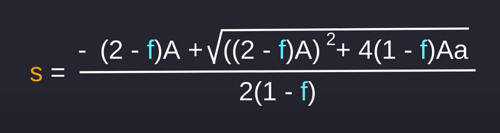

# Optimal One-sided Supply

    A = amount token A in uniswap
    B = amount token B in uniswap
    f = trading fee
    a = amount token A I have
    b = ? amount token B i need
    s = ? amount token A we will swap for B

    K = A * B

    K = (A + (1-f)*s) * (B - b)

    Formula:

    s = (sqrt(((2-f)r)^2 + 4(1-f)a*r) - (2-f)*r ) / (2*(1-f))

        sqrt((( 2 - f ) r )^2 + 4 ( 1 - f ) a * r ) - (2 - f) * r
    s = __________________________________________________________
                    2 * (1 - f)

    Example:

    A = 500
    B = 250
    f = 0.3%
    a = 200
    b = ?
    s = ?

    K = (A + (1-f)*s) * (B - b)

    125.000 = (500 + (1-0.3 % 100) * s) * (250 - b)

[Youtube source](https://www.youtube.com/watch?v=1ivHqueaTVo)
