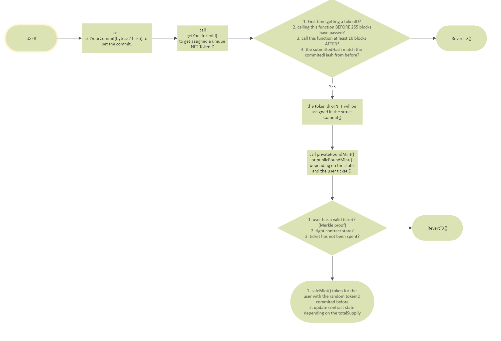

## Advanced NFT

	- Implement Merkle tree airdrop for one-time minting
	- Measure gas cost of mapping vs. bitmap for tracking minted addresses
	- Use commit-reveal for randomly allocating NFT IDs
	- NFT should use state machine to control minting, presale, public sale, and supply run-out
	- Use payment splitter for distribution of funds

## Flow WhiteList.sol for the user

## Admin outcomes in WhiteList.sol

## Flow AdvancedNFT.sol for the user

